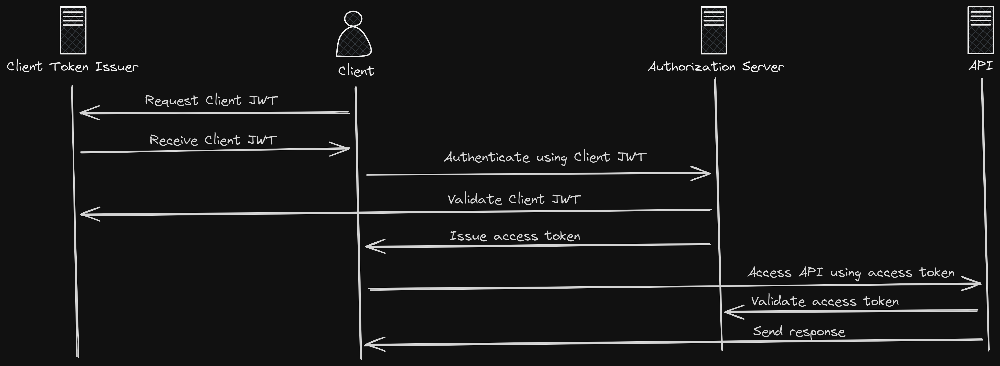

# Secretless authentication using token exchange

The [RFC 7523](https://datatracker.ietf.org/doc/html/rfc7523) is a specification that defines the use of a JWT Bearer Token as a means for requesting an OAuth 2.0 access token as well as for client authentication.

This is a demonstration to showcase [using JWTs for client authentication](https://datatracker.ietf.org/doc/html/rfc7523#section-2.2) to enable authentication without sharing a secret.

It is built around Azure, but the client (Azure DevOps in this case) and the authorization server (Entra in this case) could just as easily be other services.

A simplified example looks like this:

## Client: Azure DevOps

### Azure DevOps Organization Name

The name of your Azure DevOps organization is required. Store as `AZURE_DEVOPS_ORG_NAME`.

### Azure DevOps Organization ID

When logged on to Azure DevOps, go to this url (but change to your org name) `https://dev.azure.com/<AZURE_DEVOPS_ORG_NAME>/_apis/connectiondata?api-version=5.0-preview.1&%24format=swagger`.

Store the value for `instanceId` as `AZURE_DEVOPS_ORG_ID`.

### Create Azure DevOps project

Create a project and store the name as `AZURE_DEVOPS_PROJECT_NAME`.

### Create Azure DevOps repository

Create a repository in your project and store the name as `AZURE_DEVOPS_REPOSITORY_NAME`.

## Authorization Server: Entra

## Entra Tenant ID

Store the Entra Tenant ID as `ENTRA_TENANT_ID`.

## Create application

Store the Client ID as `ENTRA_CLIENT_ID`.

## Federated credentials

Go to App registrations > Your application > Manage > Certificates & secrets > Federated credentials > Add credential

- Federated credential scenario: Other issuer
- Issuer: `https://vstoken.dev.azure.com/<AZURE_DEVOPS_ORG_ID>`
- Subject identifier: `p://<AZURE_DEVOPS_ORG_NAME>/<AZURE_DEVOPS_PROJECT_NAME>/<AZURE_DEVOPS_REPOSITORY_NAME>`
- Name: `AZURE_DEVOPS_ORG_NAME>_<AZURE_DEVOPS_PROJECT_NAME>_<AZURE_DEVOPS_REPOSITORY_NAME>`
- Audience: Leave default (`api://AzureADTokenExchange`)
- Press `Add`
